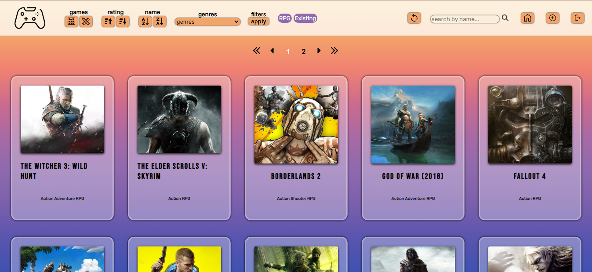
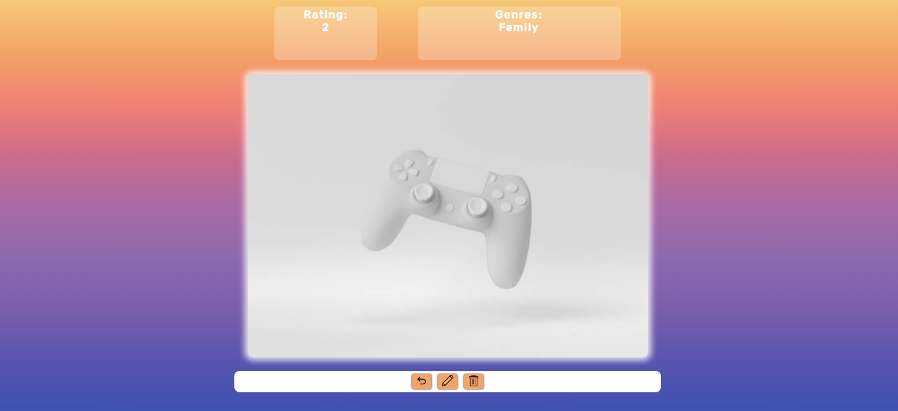

# **VIDEOGAMES**

## **📌 OBJETIVOS**

-  Construir una Single Page Application utlizando las tecnologías: **React**, **Redux**, **Node**, **Express** y **Sequelize**.
-  Poner en práctica recursos básicos de estilos y diseño (UX : UI).
-  Afirmar y conectar los conceptos aprendidos en la carrera.
-  Aprender mejores prácticas.
-  Aprender y practicar el workflow de GIT.

 

---

## **✔ Lo que se quiere lograr con el proyecto**

La idea general es crear una aplicación en la cual se puedan ver distintos videojuegos junto con información relevante de los mismos utilizando la api externa [**rawg**](https://rawg.io/apidocs) y a partir de ella poder, entre otras cosas:

- Buscar videojuegos
- Filtrarlos / Ordenarlos
- Crear nuevos videojuegos y su detalle

 

---

## **Tecnologias necesarias**
- [ ] React
- [ ] Redux
- [ ] Express
- [ ] Sequelize - Postgres
- [ ] CSS Puro

### **🖱 FRONT-END**

Caracteristicas:

**📍 LANDING PAGE |** deberás crear una página de inicio o bienvenida con:

-  Botón para ingresar a la **`home page`**.

 

**📍 HOME PAGE |** debe contener:

-  Input de búsqueda para encontrar videojuegos por nombre.
-  Sector en el que se vea un listado de cards con los videojuegos y deberá mostrar su:
   -  Imagen.
   -  Nombre.
   -  Géneros.
-  Cuando se le hace click a una Card deberá redirigir al detalle de ese videojuego específico.
-  Botones/Opciones para **filtrar** por género, y por si su origen es de la API o de la base de datos.
-  Botones/Opciones para **ordenar** tanto ascendentemente como descendentemente los videojuegos por orden alfabético y por rating.
-  Paginado para mostrar un total de 15 videojuegos por página.

 

 

**📍 DETAIL PAGE |** deberá mostrar toda la información específica de un videojuego:

-  ID.
-  Nombre.
-  Imagen.
-  Plataformas.
-  Descripción.
-  Fecha de lanzamiento.
-  Rating.
-  Géneros.
En el caso de ser creado y almacenado en la base de datos, tendrá un boton para ser actualizado y un boton para ser eliminado.

 

 

**📍 FORM PAGE |**: en esta vista se encontrará el formulario para crear un nuevo videojuego.

Este formulario es **controlado completamente con JavaScript**. Cuenta con los siguientes campos:
-  Nombre.
-  Imagen(en caso de no agregar imagen, tendrá una de defecto).
-  Descripción.
-  Plataformas.
-  Fecha de lanzamiento.
-  Rating.
-  Posibilidad de seleccionar/agregar varios géneros en simultáneo.
-  Botón para crear el nuevo videojuego.

 

**📍 UPDATE |**: en esta vista se encontrará el formulario para actualizar el videojuego creado anteriormente.

Es **controlado completamente con JavaScript** y cuenta con los siguientes campos a ser actualizados:
-  Nombre.
-  Imagen(en caso de no agregar imagen, tendrá una de defecto).
-  Descripción.
-  Plataformas.
-  Fecha de lanzamiento.
-  Rating.
-  Posibilidad de seleccionar/agregar varios géneros en simultáneo.
-  Botón para actualizar el videojuego.
-  Botón para volver en caso de arrepentimiento.

 
---

### **🖱 BASE DE DATOS**

Crear dos modelos para la base de datos. La relación entre ambos modelos es de muchos a muchos.

**📍 MODELO 1 | Videogames**

-  ID (son distintos a los que vienen de la API). \*
-  Nombre. \*
-  Descripción. \*
-  Plataformas. \*
-  Imagen. \*
-  Fecha de lanzamiento. \*
-  Rating. \*

 

**📍 MODELO 2 | Genres**

-  ID. \*
-  Nombre. \*

 

---
### **🖱 BACK-END**

Construir un servidor utilizando **NodeJS** y **Express**. Conectarlo con la base de datos mediante **Sequelize**.

El servidor cuenta con las siguientes rutas:

#### **📍 GET | /videogames**

-  Obtiene un arreglo de objetos, donde cada objeto es un videojuego con su información.

#### **📍 GET | /videogames/:idVideogame**

-  Esta ruta obtiene el detalle de un videojuego específico. Es decir que devuelve un objeto con la información pedida en el detalle de un videojuego.
-  El videojuego es recibido por parámetro (ID).
-  Tiene que incluir los datos del género del videojuego al que está asociado.
-  Debe funcionar tanto para los videojuegos de la API como para los de la base de datos.

#### **📍 GET | /videogames/name?="..."**

-  Esta ruta debe obtener los primeros 15 videojuegos que se encuentren con la palabra recibida por query.
-  Debe poder buscarlo independientemente de mayúsculas o minúsculas.
-  Si no existe el videojuego, debe mostrar un mensaje adecuado.
-  Debe buscar tanto los de la API como los de la base de datos.

#### **📍 POST | /videogames**

-  Esta ruta recibirá todos los datos necesarios para crear un videojuego y relacionarlo con sus géneros solicitados.
-  Toda la información debe ser recibida por body.
-  Debe crear un videojuego en la base de datos, y este debe estar relacionado con sus géneros indicados (al menos uno).

#### **📍 GET | /genres**

-  Obtiene un arreglo con todos los géneros existentes de la API.
-  En una primera instancia, cuando la base de datos este vacía, deberás guardar todos los géneros que encuentres en la API.
-  Estos deben ser obtenidos de la API. Luego de obtenerlos de la API, deben ser guardados en la base de datos para su posterior consumo desde allí.

 

