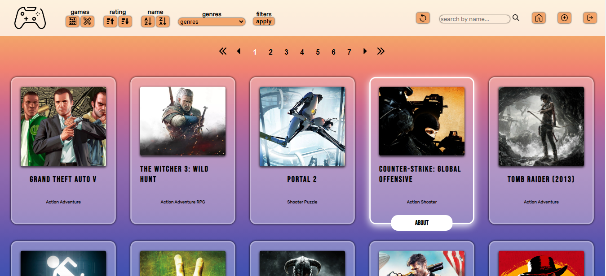
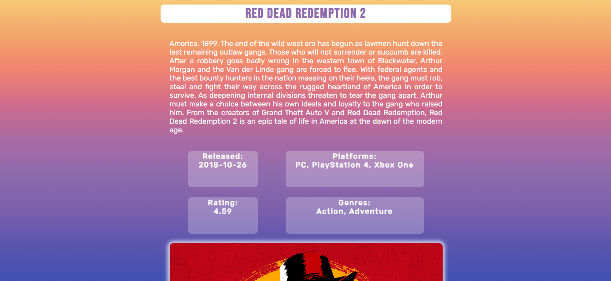
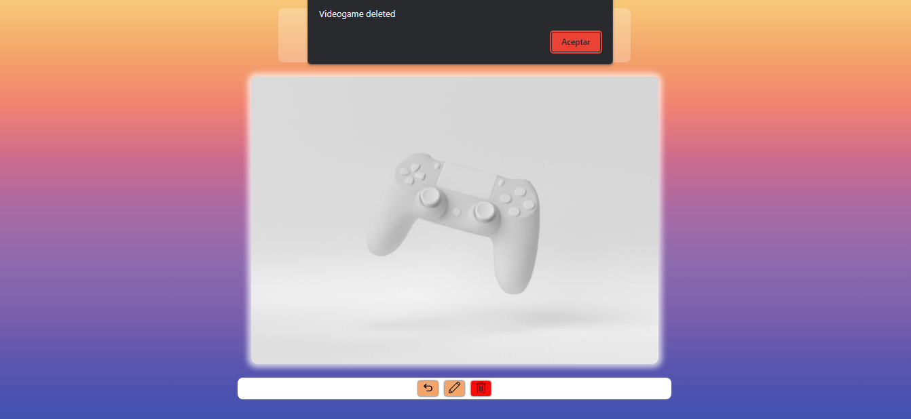
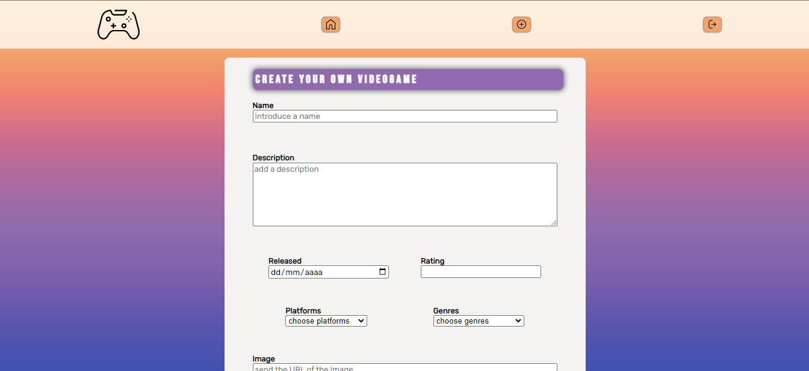
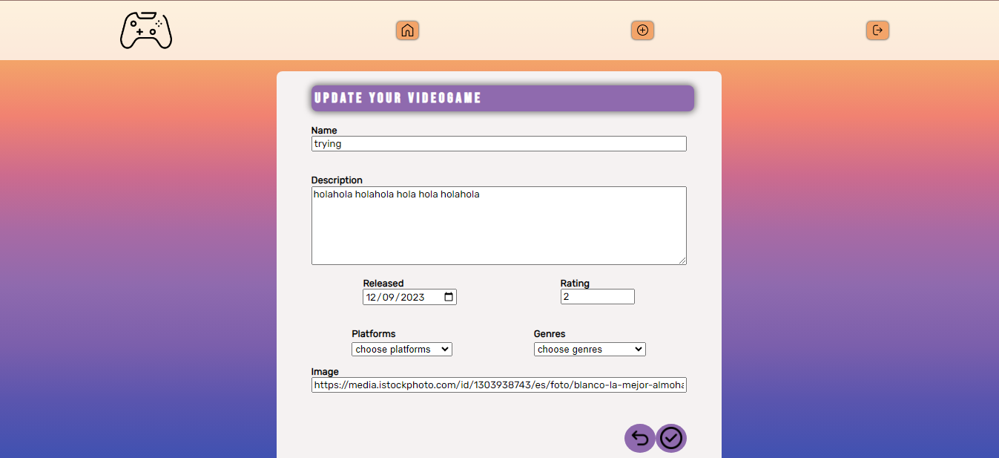

# **VIDEOGAMES**

## **📌 OBJETIVOS**

-  Construir una Single Page Application utlizando las tecnologías: **React**, **Redux**, **Node**, **Express** y **Sequelize**.
-  Poner en práctica recursos básicos de estilos y diseño (UX : UI).
-  Afirmar y conectar los conceptos aprendidos en la carrera.
-  Aprender mejores prácticas.
-  Aprender y practicar el workflow de GIT.
-  Utilizar y practicar testing.

 

---

## **✔ Lo que se quiere lograr con el proyecto**

La idea general es crear una aplicación en la cual se puedan ver distintos videojuegos junto con información relevante de los mismos utilizando la api externa [**rawg**](https://rawg.io/apidocs) y a partir de ella poder, entre otras cosas:

- Buscar videojuegos
- Filtrarlos / Ordenarlos
- Crear nuevos videojuegos y su detalle

 

---

## **Tecnologias necesarias**
- [ ] React
- [ ] Redux
- [ ] Express
- [ ] Sequelize - Postgres
- [ ] CSS Puro

### **🖱 FRONT-END**

Caracteristicas:

**📍 LANDING PAGE |** deberás crear una página de inicio o bienvenida con:

-  Botón para ingresar a la **`home page`**.

 

**📍 HOME PAGE |** debe contener:

-  Input de búsqueda para encontrar videojuegos por nombre.
-  Sector en el que se vea un listado de cards con los videojuegos y deberá mostrar su:
   -  Imagen.
   -  Nombre.
   -  Géneros.
-  Cuando se le hace click a una Card deberá redirigir al detalle de ese videojuego específico.
-  Botones/Opciones para **filtrar** por género, y por si su origen es de la API o de la base de datos.
-  Botones/Opciones para **ordenar** tanto ascendentemente como descendentemente los videojuegos por orden alfabético y por rating.
-  Paginado para mostrar un total de 15 videojuegos por página.

 

**📍 DETAIL PAGE |** deberá mostrar toda la información específica de un videojuego:

-  ID.
-  Nombre.
-  Imagen.
-  Plataformas.
-  Descripción.
-  Fecha de lanzamiento.
-  Rating.
-  Géneros.
En el caso de ser creado y almacenado en la base de datos, tendrá un boton para ser actualizado y un boton para ser eliminado.

 

 

**📍 FORM PAGE |**: en esta vista se encontrará el formulario para crear un nuevo videojuego.

Este formulario es **controlado completamente con JavaScript**. Cuenta con los siguientes campos:
-  Nombre.
-  Imagen.
-  Descripción.
-  Plataformas.
-  Fecha de lanzamiento.
-  Rating.
-  Posibilidad de seleccionar/agregar varios géneros en simultáneo.
-  Botón para crear el nuevo videojuego.

 

**📍 UPDATE |**: en esta vista se encontrará el formulario para actualizar el videojuego creado anteriormente.

Es **controlado completamente con JavaScript** y cuenta con los siguientes campos a ser actualizados:
-  Nombre.
-  Imagen.
-  Descripción.
-  Plataformas.
-  Fecha de lanzamiento.
-  Rating.
-  Posibilidad de seleccionar/agregar varios géneros en simultáneo.
-  Botón para actualizar el videojuego.
-  -Botón para volver en caso de arrepentimiento.

 
---

 

### **🖱 TESTING**

Ten en cuenta que en esta instancia no es obligatorio el desarrollo de testing para tu aplicación. De igual manera, te desafiamos a que los hagas, ¡ya que suman puntos!

-  Al menos tener un componente del frontend con sus tests respectivos.
-  Al menos tener dos rutas del backend con sus tests respectivos.
-  Al menos tener un modelo de la base de datos con sus tests respectivos.

 

---

 

